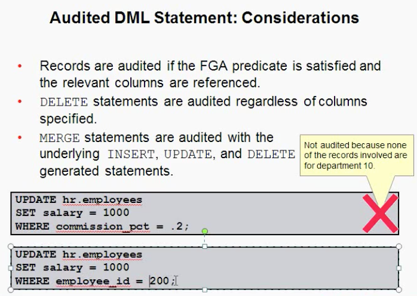

# 实施oracle数据库的审计

## Locks（锁）

- Prevent multiple sessions from changing the same data at the same time.
- Are automatically obtained at the lowest possible level for a given statuement.
- Do not escalate(逐步升级).  
数据库的基本功能，防止数据的不一致。

## 表的级别

- 表级锁：针对整个表进行加锁。
- 行级锁：只针对表中行进行加锁。
- 排他锁：一个事物对一个表(行)进行加锁之后，那么其他事务就不能加同样的锁。
    + DDL: ALTER DROP (表)
    + DML: UPDATE DELETE (行)
- 共享锁：当一个事物执行时对表(行)进行操作时加锁，其它事务也可对此表(行)进行加锁。
    + DML: SELECT

## Locking Mechanism

- High level of data concurrency:  
    + Row-level locks for inserts,updates,and deletes
    + No locks required for queries
- Automatic queue management
- Locks held until the transaction ends (with the **COMMIT** or **ROLLBACK** operation.)

## Possible Causes of Lock Conflicts

- Uncommitted changes
- Long-running transactions
- Unnecessarily high locking levels

## Detecting Lock Conflicts & Resolving Lock Conflicts With SQL

- 使用如下sql语句检查数据库是否有锁冲突
```sql
SQL> run
  1  select username,sid,serial#,blocking_session from v$session
  2* where username is not null

USERNAME                              SID    SERIAL# BLOCKING_SESSION
------------------------------ ---------- ---------- ----------------
SCOTT                                 146      41283
SYS                                   162       2307
SCOTT                                 194       5263              146
```

- 使用如下sql语句终止一个blocking的session
```sql
SQL> alter system kill session '146,41283';  
```

## Deadlocks(死锁) & Resolving Deadlocks

- 两个事务互相等待对方释放资源，oracle认定为产生了死锁，在这种情况下，将以牺牲一个事务作为代价，另一个事务继续执行，牺牲的事务将回滚。
- ORA-00060的错误并记录在数据库的日志文件alertSID.log中。同时在user_dump_dest下产生一个跟踪文件，详细描述死锁的相关信息。

### Resolving 

- 执行commit或者rollback结束事务
- 终止会话`(alter system kill session 'SID,SERIAL#')`


## Managing Undo data

Undo data is:  

- A copy of original, premodified data
- Captured for every transaction that changes data
- Retained at least until the transaction id ended
- Used to support:
    + Rollback operations
    + Read-consistent queries
    + Oracle Flashback Query, Oracle Flashback Transaction, and Oracle Flashback Table
    + Recovery from failed transactions

为了保证在一次事务中读取数据的一致性，undo数据在undo表空间中默认保留(Retained)900秒。

查询表空间：  
```sql
SQL> select tablespace_name,contents
  2  from dba_tablespaces;

TABLESPACE_NAME                CONTENTS
------------------------------ ---------
SYSTEM                         PERMANENT
SYSAUX                         PERMANENT
UNDOTBS1                       UNDO
TEMP                           TEMPORARY
USERS                          PERMANENT
XLSGRID                        PERMANENT

6 rows selected.
```

查询数据库当前使用的undo表空间：
```sql
SQL> show parameter undo_tablespace

NAME                                 TYPE        VALUE
------------------------------------ ----------- ------------------------------
undo_tablespace                      string      UNDOTBS1
```

查询undo数据段再事务提交后的保存时间(单位：秒)：
```sql
SQL> show parameter undo_retention;

NAME                                 TYPE        VALUE
------------------------------------ ----------- ------------------------------
undo_retention                       integer     900
```

    Ps：一般情况下不会让UNDO表空间自动扩展，因为不可控。

### Managing Undo

Automatic undo management:  

- Fully automated management of undo data and space in a dedicated undo tablespace
- For all sessions
- Self-tuning in AUTOEXTEND tablespaces to satisfy long-runging queries
- Self-tunning in fixed-size tablespaces for best retention

DBA tasks in support of Flashback operations:  

- Configuring undo retention
- Changing undo tablespace to a fixed size
- Avoiding space and "snapshot too old" errors

#### Configuring undo retention：

- Guaranteeing Undo Retention(undo数据的保留时间要得到保证，默认当undo表空间用完时，自动覆盖)

```sql
SQL> run   //查询保留是否得到保证
  1  select tablespace_name,contents,retention from dba_tablespaces
  2* where tablespace_name = 'UNDOTBS1'

TABLESPACE_NAME                CONTENTS  RETENTION
------------------------------ --------- -----------
UNDOTBS1                       UNDO      NOGUARANTEE

SQL> ALTER TABLESPACE undotbs1 RETENTION GUARANTEE; //开启保证

SQL> ALTER TABLESPACE undotbs1 RETENTION GUARANTEE; //关闭保证
```

## Implementing Oracle Database Auditing  
为了数据库的安全，避免非法访问和数据泄漏，对数据库的时间进行记录

### Separation(分开) of Responsibilities(职责)  

- Users with DBA privileges must be trusted.
    + Abuse(滥用) of trust
    + Audit trails protecting the trusted position
- DBA responsibilities must be shared.
- Accounts must never be shared.
- The DBA and the system administrator must be different people.
- Separate operator and DBA responsibilities.

### Database Security

A secure system ensures(确定) the confidentiality(机密性) of the data that it contains. There are several aspects(方面) of security:

- Restricting(限制) access to data services.
- Authenticating users.
- Monitoring for suspicious(可疑的) activity.

### Monitoring for Compliance(规章)  

Monitoring or auditing must be an integral(完整的) part of your security procedures(过程).  
Review the following: 

- Mandatory(强制的) autiting.
    + 比如：sys用户的登录和推出
- Standard database auditing.
    + 需要DBA配置和激活
- Value-based auditing.
    + 针对用户对表数据的访问
- Fine-grained(详细的) auditing (FGA)
    + 主要针对SQL语句的审计
- SYSDBA (and SYSOPER) auditing.

### Standard Database Auditing  


### Configuring the Audit Trail  

Use AUDIT_TRAIL to enable database auditing.  
```sql
SQL> show parameter audit_trail;

NAME                                 TYPE        VALUE
------------------------------------ ----------- ------------------------------
audit_trail                          string      DB
```

VALUE值：  

- NONE：关闭审计
- OS：将数据库审计结果记录在操作系统里，windows在事件查看器中查看，UNIX：记录在操作系统文件里面(audit_file_dest参数指定的目录里)。  
```sql
    SQL> show parameter audit_file_dest;

    NAME                                 TYPE        VALUE
    ------------------------------------ ----------- ------------------------------
    audit_file_dest                      string      /u/home/oracle/database/admin/
                                                     gzyy/adump
```
- DB：审计结果记录在数据库内部，可以通过数据字典视图查看。
- DB EXTENDED：同DB，比DB记录的要详细。
- XML：审计结果存放在操作系统里，为xml文件，路径参数：audit_file_dest
- XML EXTENDED

修改：  
```sql
SQL> ALTER SYSTEM SET AUDIT_TRAIL='XML' SCOPE=SPFILE;
```
Restart database after modifying this static initialization parameter.  

### Uniform Audit Trails 


### Specifying Audit Options

- SQL statement auditing:  

        AUDIT table;
        针对DDL进行审计：CREAT TABLE, DROP TABLE, ALTER TABLE  
        可以针对特定的用户：  
            AUDIT TABLE BY scott;
        可以对用户的每次DDL操作都进行一次审计：  
            AUDIT TABLE BY scott by access;
        可以对用户的每次成功(失败)的DDL进行审计：  
            AUDIT TABLE BY scott by access whenever [no]successful;  

        查询审计结果：  
        SQL> select username,timestamp,action_name from dba_audit_trail
          2  where username='SCOTT';

- System-privilege auditing (nonfocused and focused):  

        AUDIT select any table, create any trigger;
        AUDIT select any table BY hr BY SESSION;

- Object-Privilege auditing (nonfocused and focused):  

        AUDIT ALL on hr.employees;
        AUDIT UPDATE,DELETE ON hr.employees BY ACCESS;

- Ps：取消审计使用：NOAUDIT

        noaudit select any table;

### Default Auditing


### Value-Based Auditing


    触发器(Trigger)在表上只能监控一下三种操作：
        INSERT  UPDATE  DELETE

- 创建触发器：
    
    监视用户在表DEPT上的INSERT  UPDATE  DELETE   

        (1) 创建表：  
                SQL> conn scott/tiger
                Connected.
                SQL> create table action
                  2  (oper_user char(10),
                  3  oper_time char(30),
                  4  oper_type char(10)
                  5  );

                Table created.
            
        (2) 创建触发器：  
                SQL> run
                  1  create or replace trigger trg1
                  2  before
                  3  insert or update or delete
                  4  on dept
                  5  begin
                  6      if deleting then
                  7     insert into action values(user,to_char(sysdate,'YYYY-MM-DD HH24:MI:SS'),'DELETE');
                  8      elsif updating then
                  9     insert into action values(user,to_char(sysdate,'YYYY-MM-DD HH24:MI:SS'),'UPDATE');
                 10      else
                 11     insert into action values(user,to_char(sysdate,'YYYY-MM-DD HH24:MI:SS'),'INSERT');
                 12      end if;
                 13* end;

                Trigger created.

        (3) 使用sys用户创建user1来测试：
                SQL> conn sys as sysdba
                Enter password: 
                Connected.
                SQL> create user user1 identified by "abcd1234";

                User created.

                SQL> grant resource,connect to user1;

                Grant succeeded.

        (4) 使用scott用户将dept的 增、删、改、查 权限授权给user1：
                SQL> conn scott/tiger
                Connected.
                SQL> grant select,insert,update,delete on dept to user1;

                Grant succeeded.

        (5) 使用user1用户对dept操作进行测试：
                SQL> conn user1/abcd1234   
                Connected.
                SQL> select * from scott.dept;

                    DEPTNO DNAME          LOC
                ---------- -------------- -------------
                        50 NETWORK        BEIJING
                        10 ACCOUNTING     NEW YORK
                        20 RESEARCH       DALLAS
                        30 SALES          CHICAGO
                        40 OPERATIONS     BOSTON
                SQL> run
                  1* insert into scott.dept values(60,'Wangjueji','shanghai')

                1 row created.

        (6) 切换至 scott 查看 action 表中是否有记录：
                SQL> conn scott/tiger
                Connected.
                SQL> select * from action;

                OPER_USER  OPER_TIME                      OPER_TYPE
                ---------- ------------------------------ ----------
                USER1      2017-11-09 22:52:27            INSERT

### Fine-Grained Auditing


### FGA Policy


### Audited DML statement:Considerations 



### FGA Guidelines


### sysDBA Auditing


### Maintaining the Audit Trail


### Oracle Audit Vault

